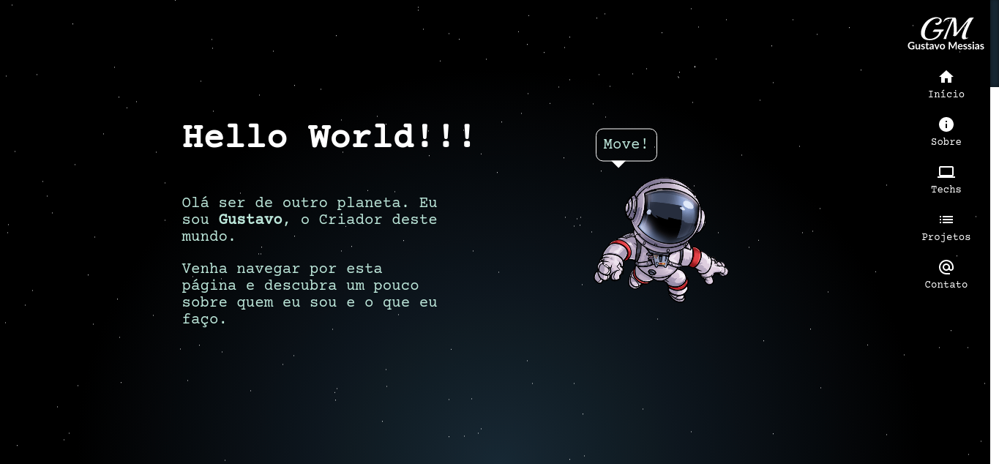

# Portfolio

Este projeto trata-se sobre mim, contando um pouco sobre minha introdução a programação, técnicas e habilidades adquiridas, alguns projetos que participei e por fim um espaço para você entrar em contato comigo.

link para página -> [portfolio Gustavo Messias](https://gustavo-messias.vercel.app/).

## Componentes principais

está listado abaixo algumas features que este projeto contém:

- astronauta flutuante, dando ao usuário a opção de move-lo pela página dado limites fixados.
- Carousel de projetos com imagens em gif.
- estrelas que movem no background.
- formulário para envio de email.
